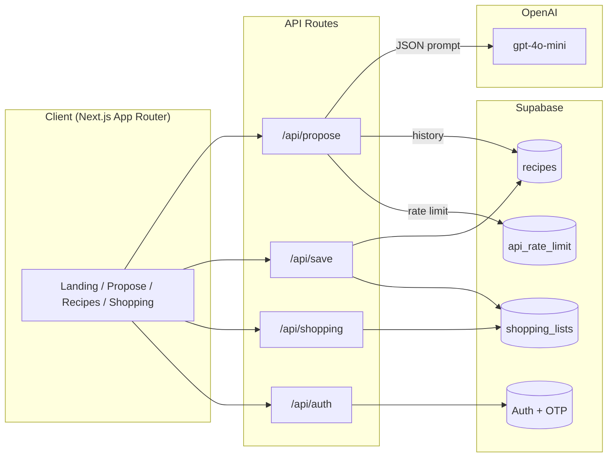

# YoruMeal

> YoruMeal は「毎日の夕食の献立を考える負担をなくしたい」という課題から生まれた、
レシピ提案・レシピ管理・買い物リスト自動生成を行う Web アプリです。
毎日の夕食作りがもっと楽しく、もっと簡単になるように、あなたに寄り添ったレシピを提案します。

[](https://nextjs.org) [](https://supabase.com) [](https://platform.openai.com/)

---

## 主な機能
1. **レシピ提案**: 除外食材・利用可能な調理器具・人数・目標・予算を入力し、LLM から 1 件のレシピを提案。
2. **保存**: 気に入ったレシピと買い物リストを保存。
3. **閲覧 & 詳細**: 保存済みレシピをリスト/詳細表示で振り返り、買い物リストを再生成。
4. **買い物リスト**: 全レシピ横断で統合された買い物リストをカテゴリ別にチェックしながら進捗管理。

---

## 技術スタック
| カテゴリ | 採用技術 |
| --- | --- |
| フロントエンド | Next.js 15 (App Router), React 19, TypeScript, Server Components |
| スタイリング | Tailwind CSS v4, shadcn/ui, lucide-react |
| バックエンド | Next.js Route Handlers (Edge Runtime), Supabase |
| データベース・認証 | Supabase (PostgreSQL + Row Level Security), メールOTP認証 |
| AI・LLM | OpenAI `gpt-4o-mini` (JSON response format) |
| テスト | Jest + @edge-runtime/jest-environment, Testing Library, Playwright |
| デプロイ | Vercel (Next.js), Supabase (DB/Auth) |

---

## アーキテクチャ概要


---

## 主な画面
- `/` : プロダクト概要と導線をまとめた LP。  
- `/propose` : 除外食材/調理器具/人数/予算/目標を指定しレシピ生成。  
- `/recipes` : 保存済みレシピの一覧。  
- `/recipes/[id]` : 材料・作り方・使用する調理器具・保存日時・買い物リスト生成ボタン。  
- `/shopping` : 統合買い物リスト（カテゴリフィルタ・進捗バー・チェックボックス・完了ボタン）。  

---

## ディレクトリ構成（抜粋）
```
yoru-meal
├─ docs/
│   └─ system-spec.md          # 要件・非機能・データ設計
├─ src/
│   ├─ app/
│   │   ├─ (protected)/        # 認証必須ページ（Propose / Recipes / Shopping）
│   │   ├─ api/                # Route Handlers (auth / propose / save / shopping)
│   │   └─ lib/                # Supabase クライアント, Zod スキーマ, 型
│   ├─ components/             # UI コンポーネント群 (shadcn/ui など)
│   └─ lib/                    # 共通 hooks / utils
└─ e2e/                        # Playwright シナリオ
```

---

## 機能ハイライト
- **LLM レシピ提案 API**  
  - `/api/propose` で入力検証 → レート制限 → 過去レシピの重複回避 → OpenAI 呼び出し → Zod 検証 を一連で実施。  
 
  - `api_rate_limit` テーブルでユーザー/IP 単位に提案回数 1 日 10 回の制限。  

- **保存〜閲覧の UX**  
  - `/recipes` は最新順カード表示、`/recipes/[id]` で材料・作り方・調理器具を整理し、買い物リスト作成導線を配置。  

- **統合買い物リスト画面**  
  - `/shopping` はカテゴリフィルタ、進捗バー、チェック、完了時の一括削除、エラー/空状態 UI を備えたワンストップ体験。  
  - 同一食材+単位をマージし、どのレシピ由来かを表示することで過剰購入を防止。  

- **品質管理**  
  - `src/app/api/propose/__tests__/route.test.ts` などで API の入出力を Jest + Edge Runtime で検証。  
  - `e2e/full-flow.spec.ts` で LP → ログイン → 提案 → 保存 → 買い物までを Playwright で検証。  

---

## 今後のロードマップ
- 複数レシピの同時提案 / 比較 UI
- 提案履歴のピン留め

---


