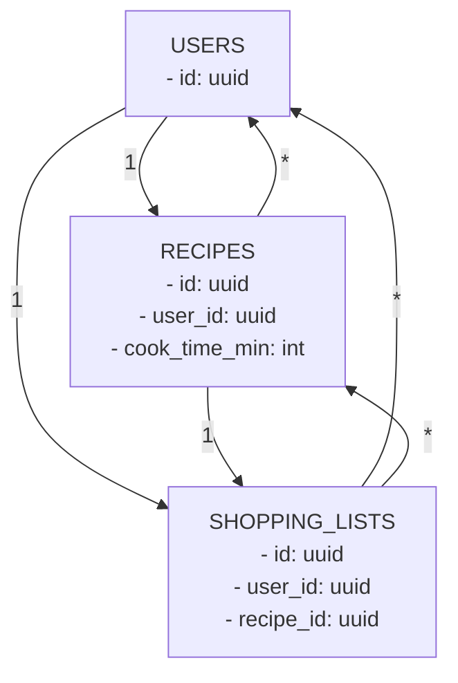

# 仕様書 - yoru-meal (MVP)

バージョン: v0.3\
最終更新: 2025-01-27 (JST)

---

## 1. 目的 / 背景

- 忙しい一人暮らし社会人を対象に、**夕食メニューの自動提案**と**買い物リスト生成**、**レシピ保存/閲覧**を提供する。
- ポートフォリオ用途として、**モダンWeb実装（Next.js / Supabase / OpenAI）****と****RLSを伴う安全なデータ設計**を示す。

---

## 2. スコープ

### 含む（MVP）

- 除外食材・利用可能な調理器具を入力 → LLMで**1件の実用レシピ**を提案
- **不足分のみ**の買い物リスト生成
- レシピの**保存**、**一覧**、**詳細閲覧**
- **全件統合**の買い物リスト表示（カテゴリ別フィルタ、進捗表示、チェックはローカル状態）
- メールOTP認証（Supabase Auth）、RLS有効化

### 含まない（今後）

- 複数レシピ横断の買い物リスト統合/集約
- 栄養値・コスト自動推定、タグ検索、高度なフィルタ/PWA
- 多言語UI（日本語のみ）

---

## 3. 利用者像 / 前提

- 一人暮らし/社会人、平日夕食中心、調理時間 **30〜45分**を希望。
- 嗜好例: **酢を使わない**（既定ON）。
- 入力方針: **使いたくない食材のみ**を列挙（在庫の網羅入力は不要）。

---

## 4. ユースケース / 主要フロー

1. **メニュー提案**: 除外食材と器具を入力 → 提案を得る → 内容を確認
2. **保存**: 気に入った提案をDBに保存
3. **閲覧**: 保存一覧から詳細を確認
4. **買い物**: 直近保存レシピの買い物リストでチェックしながら購入

---

## 5. 機能要件（FR）

- FR-01: ユーザーは除外食材（文字列配列）と器具（プリセット）を入力できる。
- FR-02: システムは LLM を呼び出し、**厳密なJSON**でレシピを受領する。
- FR-03: 返却JSONは Zod スキーマで検証し、UI表示する。
- FR-04: 「保存」操作で `recipes` と `shopping_lists` に挿入される。
- FR-05: 「保存一覧」画面でユーザー自身のレシピを降順表示する。
- FR-06: 「詳細」画面で材料/手順/器具/作成日時を表示できる。
- FR-07: 「買い物リスト」画面は**全件統合表示**し、カテゴリ別フィルタ、進捗表示、チェックはローカル状態で管理する。レシピ詳細ページから買い物リストを作成できる。
- FR-08: 認証はメールOTP（マジックリンク）。未ログイン時は閲覧/保存を制限する。

---

## 6. 非機能要件（NFR）

- NFR-01: パフォーマンス: 提案API応答 6s 以内（ネットワーク・推論含む目安）。
- NFR-02: 信頼性: LLM出力が不正JSONの場合は **自動再試行1回**。
- NFR-03: セキュリティ: Supabase RLSにより `auth.uid() = user_id` のみ参照/更新可能。
- NFR-04: 運用性: ログに**LLM呼び出し回数/失敗率**を記録（簡易）。
- NFR-05: コスト: 推論は `gpt-4o-mini` を既定、過去の提案履歴を取得して重複回避により多様性を確保。
- NFR-06: アクセシビリティ: フォーム要素にラベル、タップ領域44px相当、キーボード操作可能。
- NFR-07: レート制限: 提案APIは1分間に5回まで、ユーザーIDまたはIPアドレス単位で制限。

---

## 7. 画面仕様（要素構成）

### 7.1 トップ（LP） `/`

- 要素: タイトル、機能説明3カード、はじめかた、ナビ（提案/保存一覧/買い物リスト/ログイン）
- 状態: ログイン済/未ログイン

### 7.2 提案 `/propose`

- 入力: 除外食材テキスト（改行/読点区切り）、器具チェック、人数、目標、予算
- アクション: 「レシピを提案」→ 結果カード表示（タイトル/説明/時間/材料/手順/器具/保存ボタン）
- 例外: 422（検証失敗）、429（レート制限）、500（LLM/ネットワーク）

### 7.3 保存一覧 `/recipes`

- 要素: タイトル、各レシピカード（タイトル/時間/作成日時/詳細リンク）
- 例外: 未ログイン → ログイン導線

### 7.4 詳細 `/recipes/[id]`

- 表示: タイトル、説明、所要時間、材料リスト（買い物リスト作成ボタン付き）、手順、器具、作成日時
- 例外: 404（存在しない or 他人のレシピ/RLS）

### 7.5 買い物 `/shopping`

- 全レシピの買い物リストを統合表示（同じ食材名・単位のアイテムは統合）
- カテゴリ別フィルタ（肉、魚、野菜、調味料、その他）
- 進捗表示（完了数/総数、プログレスバー）
- チェックはローカル状態で管理
- アイテム削除機能
- 買い物完了時に全件削除

---

## 8. API仕様（App Router）

### 8.1 POST `/api/propose`

**目的**: LLMにレシピを生成させる。\
**入力**（例）:

```json
{
  "exclude_ingredients": ["酢", "ピーマン"],
  "available_tools": ["電子レンジ", "フライパン", "鍋", "トースター"],
  "servings": 1,
  "goals": ["時短"],
  "budget_level": "low",
  "locale": "JP"
}

**入力パラメータ詳細**:
- `exclude_ingredients`: 除外する食材の配列（デフォルト: 空配列）
- `available_tools`: 利用可能な調理器具の配列（デフォルト: 空配列）
- `servings`: 人数（デフォルト: 1）
- `goals`: 料理の目標・希望の配列（デフォルト: ["時短"]）。選択肢: "時短"|"ボリューム重視"|"バランス重視"|"ヘルシー"
- `budget_level`: 予算レベル "low"|"medium"|"high"（デフォルト: "low"）
- `locale`: ロケール（デフォルト: "JP"）

```

**出力**（例）:

```json
{
  "title": "鶏むねのねぎ塩レンジ蒸し",
  "description": "電子レンジで簡単に作れるヘルシーな鶏むね肉料理",
  "cook_time_min": 20,
  "ingredients": [
    {"name":"鶏むね肉","qty":1,"unit":"枚","optional":false},
    {"name":"長ねぎ","qty":0.5,"unit":"本","optional":false},
    {"name":"ごま油","qty":1,"unit":"大さじ","optional":false}
  ],
  "steps": [
    "鶏むねを薄めのそぎ切りにする",
    "耐熱皿にのせて塩こしょう、ねぎ、ごま油をかけラップ",
    "電子レンジ600Wで4〜5分加熱して全体を混ぜる"
  ],
  "tools": ["電子レンジ","まな板","包丁"],
  "shopping_lists": [
    {"name":"長ねぎ","qty":1,"unit":"本","category":"野菜"}
  ],
  "notes": ["加熱後に余熱で火入れ"]
}
```

**エラー**: 400（入力不正）、422（Zod検証失敗）、429（レート制限）、500（LLM障害）

### 8.2 POST `/api/save`（認証必須）

**入力**: 上記出力JSONそのまま\
**処理**: `recipes` insert → `shopping_lists` insert（RLSにより `user_id=user.id`）\
**出力**: `{ ok: true, recipe_id: uuid }`\
**エラー**: 401（未ログイン）、500（保存失敗）

### 8.3 GET `/api/shopping/list`（認証必須）

**出力**: `[{ recipe_id, recipe_title, items[] }]`（配列形式、全件取得）\
**エラー**: 401（未ログイン）、500（取得失敗）

### 8.4 POST `/api/shopping/add`（認証必須）

**入力**: `{ recipe_id: string, ingredients: Ingredient[] }`\
**処理**: 既存の買い物リストを削除後、新しい買い物リストを作成（RLSにより `user_id=user.id`）\
**出力**: `{ ok: true }`\
**エラー**: 401（未ログイン）、400（入力不正）、404（レシピが見つからない）、500（保存失敗）

### 8.5 DELETE `/api/shopping/delete`（認証必須）

**処理**: ユーザーの全買い物リストを削除（RLSにより `user_id=user.id`）\
**出力**: `{ ok: true }`\
**エラー**: 401（未ログイン）、500（削除失敗）

### 8.6 認証導線

- `POST /api/auth/login` → メールアドレスを受け取り、Supabase OTP（マジックリンク）を送信
- `GET /api/auth/callback` → メール内のリンクから認証コードを検証し、セッション確立後、`/`へリダイレクト
- `GET /api/auth/logout` → セッション破棄後、`/`へリダイレクト

---

## 9. データモデル

### 9.1 ER（簡易）



### 9.2 テーブル

- **recipes**: `id, user_id, title, description(text), ingredients(jsonb), steps(jsonb), cook_time_min, tools(jsonb), created_at`
  - `ingredients`: `[{ name: string, qty: number, unit: string, optional?: boolean }]`
  - `steps`: `string[]`
  - `tools`: `string[]`
- **shopping\_lists**: `id, user_id, recipe_id, items(jsonb), created_at`
  - `items`: `[{ name: string, qty: number, unit: string, category?: "肉"|"魚"|"野菜"|"調味料"|"その他", checked?: boolean }]`
- **api_rate_limit**: `id, key, route, at`

### 9.3 RLSポリシー（要点）

- `SELECT/INSERT/UPDATE/DELETE`: すべて `auth.uid() = user_id` のみ許可

---

## 10. LLM設計

### 10.1 System（要旨）

- 一人暮らし**夕食のみ**、日本で入手しやすい食材、**30–45分**で調理可能。
- **JSONのみ出力**（コードブロックなし）。
- `exclude_ingredients[]` は `ingredients` / `shopping_list` に含めない。
- 過去の提案履歴（直近10件）を取得し、重複や類似レシピを避けて多様性を確保。
- `description`は200文字以内でレシピの概要を説明。
- `shopping_lists`の各アイテムには`category`（肉、魚、野菜、調味料、その他）を付与。
- 多様性を重視し、和食、洋食、中華、エスニックなど様々なカテゴリから選択。

### 10.2 パラメータ

- model: `gpt-4o-mini` / temperature: 0.7 / response\_format: `json_object`
- 再試行: JSON検証失敗時に1回自動再試行（システムプロンプトを強化して再試行）

### 10.3 バリデーション

- Zod (`OutputSchema`) で厳格検証。`cook_time_min <= 45` を担保。
- `description`は最大200文字。
- `ingredients`の各アイテムに`optional`フィールド（boolean、デフォルト: false）。
- `shopping_lists`の各アイテムに`category`フィールド（enum: "肉"|"魚"|"野菜"|"調味料"|"その他"、オプショナル）。

---

## 11. エラー処理 / UX

- LLM失敗: 「再実行」ボタン表示、内部で1回自動リトライ後にユーザー通知
- 保存失敗: 認証状態を再確認→再ログイン導線
- 404: レシピ詳細の他ユーザーデータ非公開（RLS）
- トースト: 成功/失敗の簡易通知
- レート制限: 429エラー時に「しばらくしてから再試行してください」メッセージ表示

---

## 12. ロギング / 計測（任意）

- 取得するイベント: 提案開始/成功/失敗、保存成功/失敗、買い物表示
- 方式: コンソール＋（任意で）Vercel Analytics

---

## 13. テスト計画

- 単体: `validators.ts`（Zodスキーマ）、`llm.ts`（フォーマット指定）
- 結合: `/api/propose` 応答のJSON整形/検証、`/api/save` のRLS通過
- E2E: Playwright で LP → ログイン → 提案 → 保存 → 一覧/詳細 → 買い物 の一連
- 受け入れ基準（AC）:
  - AC-01: 除外「酢」指定時、材料/買い物に酢系が含まれない
  - AC-02: 45分超の `cook_time_min` が返らない
  - AC-03: 保存後に一覧で最上部に表示される
  - AC-04: 買い物リストが `/shopping` に統合表示され、カテゴリ別フィルタが機能する
  - AC-05: レシピ詳細ページから買い物リストを作成できる

---

## 14. デプロイ / 環境

- ホスティング: Vercel（Next.js）
- DB/Auth: Supabase（Free）
- 環境変数: `NEXT_PUBLIC_SUPABASE_URL`, `NEXT_PUBLIC_SUPABASE_ANON_KEY`, `OPENAI_API_KEY`, `NEXT_PUBLIC_BASE_URL`
- 認証: メールOTP（マジックリンク）（Callback: `/api/auth/callback`）

---

## 15. リスク / 対応

- LLM JSON崩れ → response\_format + Zod + 自動再試行
- 認証リダイレクト不整合 → BASE\_URL と SITE\_URL の統一
- RLS誤設定 → SQLポリシーをマイグレーションに固定、手動変更禁止

---

## 16. 変更管理

- GitHub PR運用、main へのPRのみデプロイ。

---

## 17. トレーサビリティ（要件→実装）

- FR-01 → `/propose` UIコンポーネント
- FR-02/03 → `/api/propose`, `validators.ts`
- FR-04 → `/api/save` + RLS
- FR-05/06 → `/recipes`, `/recipes/[id]`
- FR-07 → `/shopping` + `/api/shopping/latest`
- FR-08 → `/auth/*` + Supabase Auth

---

## 18. オープン課題

-

